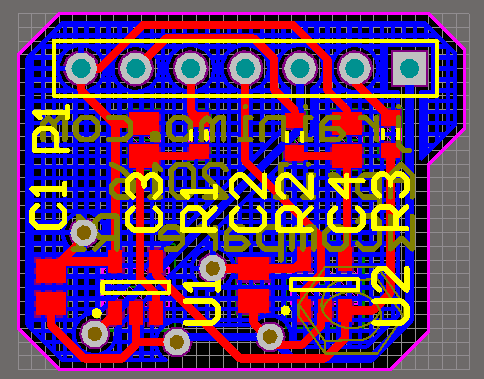

## Window Comparator

This is a breakout for two MCP6001 op amps (or similar pinout) in a window comparator configuration.

Costs like a buck on OSHPark, and should help bench testing some hardware control logic.

